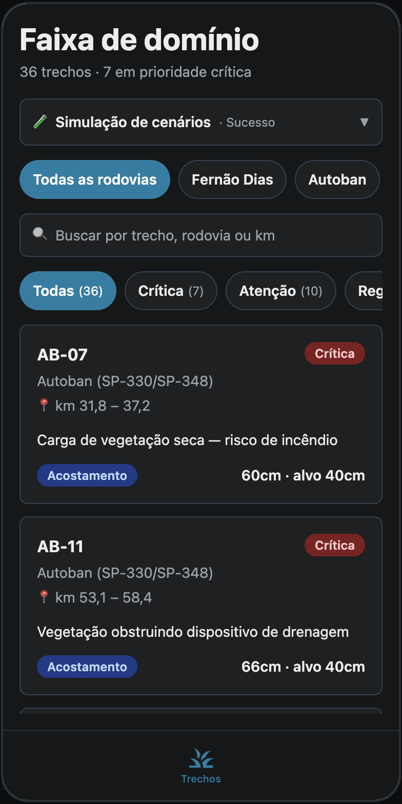
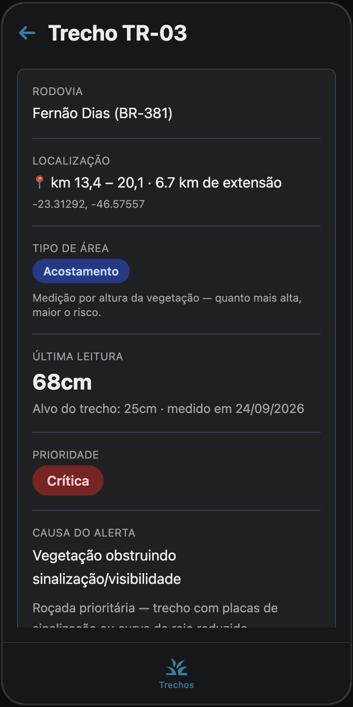
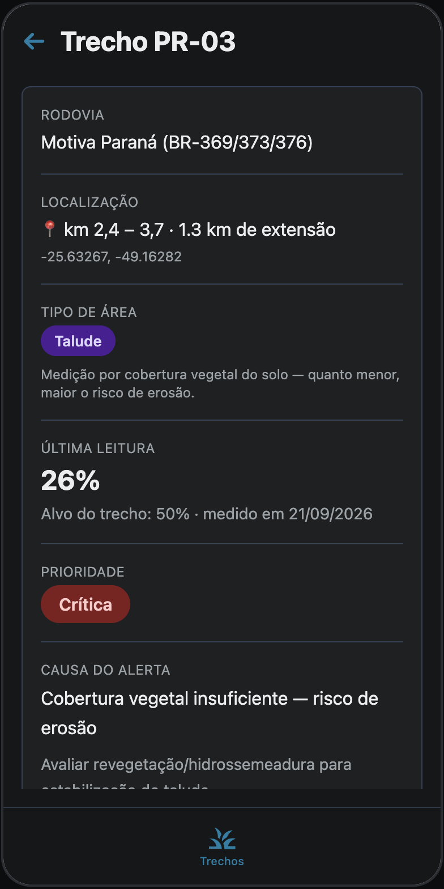

# Motiva — Gestão de Vegetação na Faixa de Domínio

Aplicativo mobile em **React Native + Expo + TypeScript + NativeWind** para o
monitoramento da vegetação na faixa de domínio de rodovias concessionadas: mede a
vegetação por trecho, ordena a fila de roçada por prioridade e mantém o histórico de
intervenções de cada ponto da malha.

**Sprint 4 — Versão Final, APK e Plano de Negócio.**

**Stack:** React Native 0.81 · Expo SDK 54 · React 19 · TypeScript 5.9 · NativeWind 4

---

## Entregas da Sprint 4

| Item | Onde está |
|---|---|
| 📦 **APK para Android** | **[Baixar Motiva v4.0.0](https://github.com/LeonardoAugustoBacelar/Sprint4-CrossPlatform-2026/releases/download/v4.0.0/Motiva-v4.0.0.apk)** |
| 🎬 **Vídeo de pitch e demonstração** | _(inserir o link do YouTube não listado)_ |
| 📊 **Plano de negócio** | [`docs/PLANO-DE-NEGOCIO.md`](docs/PLANO-DE-NEGOCIO.md) |
| 🧪 **Documento de testes** | [`docs/TESTES-MANUAIS.md`](docs/TESTES-MANUAIS.md) |
| 📱 **Capturas de tela** | [`docs/CAPTURAS.md`](docs/CAPTURAS.md) |

---

## Índice

- [O problema e a solução](#o-problema-e-a-solução)
- [Instalação do APK](#instalação-do-apk)
- [O que o app faz](#o-que-o-app-faz)
- [Como rodar o projeto](#como-rodar-o-projeto)
- [Como gerar o APK](#como-gerar-o-apk)
- [Modelagem de dados](#modelagem-de-dados)
- [Como os dados estão mockados](#como-os-dados-estão-mockados)
- [Estrutura do projeto](#estrutura-do-projeto)
- [Decisões técnicas](#decisões-técnicas)
- [Testes](#testes)
- [Evolução por Sprint](#evolução-por-sprint)
- [Plano de negócio](#plano-de-negócio)
- [Participantes](#participantes)

---

## O problema e a solução

A vegetação na faixa de domínio é tratada por **cronograma fixo**: a roçada acontece
em data marcada, não quando o trecho precisa. O resultado são dois erros simultâneos —
roçada onde ainda não era necessário e trecho crítico esperando a vez, com vegetação
obstruindo sinalização ou talude descoberto em risco de erosão.

O aplicativo substitui o cronograma por uma **fila de prioridade baseada em medição**.
Cada trecho da malha tem uma leitura de vegetação, um alvo próprio e uma prioridade
calculada; a lista chega ordenada de forma que o trecho mais crítico apareça primeiro.

**A regra que dá sentido ao produto** é que o critério se inverte conforme o tipo de área:

| Tipo de área | O que se mede | Risco cresce quando | Alvo |
|---|---|---|---|
| **Acostamento** | Altura da vegetação, em cm | A vegetação fica **alta** | 40 cm — ou **25 cm** se a causa for visibilidade |
| **Talude** | Cobertura vegetal do solo, em % | A cobertura fica **baixa** | 50% |

O alvo de 25 cm para trechos de visibilidade (curva de raio reduzido ou proximidade de
placa) é o ponto central: tratar 40 cm como limiar universal mascara risco real, porque
nesses trechos a vegetação já obstrui bem antes. A regra está em
[`src/utils/vegetacao.ts`](src/utils/vegetacao.ts) e é coberta por testes automatizados.

### O app

<p align="center">
  
  
  
</p>

<p align="center">
  <em>Fila de roçada por prioridade · alvo contextual de 25 cm · critério invertido no talude</em>
</p>

Mais telas, com o comentário do que cada uma demonstra, em
**[`docs/CAPTURAS.md`](docs/CAPTURAS.md)**.

---

## Instalação do APK

1. Baixe o arquivo `.apk` pelo link na seção [Entregas da Sprint 4](#entregas-da-sprint-4).
2. No Android, abra o arquivo baixado. O sistema vai pedir permissão para instalar
   aplicativos de fonte desconhecida — em **Configurações → Apps → Acesso especial →
   Instalar apps desconhecidos**, autorize o navegador ou o gerenciador de arquivos.
3. Confirme a instalação e abra o app **Motiva**.

**Requisitos:** Android 7.0 (API 24) ou superior. O aplicativo funciona sem conexão:
os dados ficam gravados no próprio dispositivo.

---

## O que o app faz

### Lista de trechos monitorados (Home)

Listagem ordenada por prioridade — os trechos críticos aparecem primeiro, que é a
ordem da fila de roçada. Traz seletor de rodovia (as três malhas do piloto), busca
textual e filtro por prioridade com contagem por faixa. Cada card mostra o trecho, a
rodovia, a quilometragem, a causa do alerta, o tipo de área e a leitura contra o alvo.

A tela trata cinco situações distintas: carregando, erro de carga, base vazia, busca
sem resultado e lista preenchida.

### Detalhe do trecho

Reúne o estado atual — localização com coordenada, tipo de área, última leitura, alvo,
prioridade, causa do alerta e ação recomendada — e o **histórico de intervenções**
executadas naquele ponto.

### Registro de leitura

Atualiza a medição de vegetação do trecho. A unidade, o texto de apoio e os limites de
validação mudam conforme o tipo de área: até 300 cm no acostamento, 0 a 100% no talude.
Alterar a causa para *visibilidade* endurece o alvo de 40 cm para 25 cm e pode
reclassificar o trecho na hora.

### Histórico de intervenções (CRUD completo)

Cadastro, edição e exclusão de intervenções: roçada mecânica, roçada preventiva,
hidrossemeadura, desobstrução de drenagem e monitoramento sem intervenção. Cada
registro guarda motivo, data e o resultado medido em campo (`62 cm → 9 cm`).
A exclusão passa por um diálogo de confirmação próprio.

### Simulação de cenários

Painel na Home que troca o comportamento da API simulada em tempo de execução, para
demonstrar os estados que dados estáticos nunca produziriam. Ver [a seção adiante](#como-os-dados-estão-mockados).

---

## Como rodar o projeto

**Pré-requisitos:** Node.js 18+, pnpm e um emulador Android/iOS ou o app Expo Go.

```bash
pnpm install     # instala as dependências
pnpm dev         # sobe o Metro
```

Com o Metro no ar:

- `a` no terminal abre no emulador Android
- `i` abre no simulador iOS
- ler o QR Code com o Expo Go abre em dispositivo físico

Comandos auxiliares: `pnpm check` (typecheck), `pnpm lint`, `pnpm test`, `pnpm web`.

---

## Como gerar o APK

O build é feito pelo **Expo EAS Build**, configurado em [`eas.json`](eas.json). O perfil
`preview` gera um `.apk` instalável diretamente (o perfil `production` gera `.aab`, para
a Play Store).

```bash
npx eas-cli login                 # conta Expo do grupo
npx eas-cli build:configure       # apenas na primeira vez
pnpm build:apk                    # = eas build --platform android --profile preview
```

O build roda nos servidores da Expo; ao final, o terminal devolve o link de download do
APK. **O binário não é commitado no repositório** — o link de download fica na seção
[Entregas da Sprint 4](#entregas-da-sprint-4).

---

## Modelagem de dados

Duas entidades, definidas em [`src/types/index.ts`](src/types/index.ts):

```
Trecho                             Intervencao
├── id           "TR-12"           ├── id
├── rodoviaId    fernaodias        ├── trechoId      "TR-12"
├── kmInicial    73.7              ├── data          "2026-05-18"
├── kmFinal      80.3              ├── tipo          rocada_mecanica
├── tipoArea     acostamento       ├── motivo        "Vegetação obstruindo sinalização"
├── medicao      62                └── resultado     "62 cm → 9 cm"
├── dataMedicao  "2026-09-22"
├── causa        visibilidade
├── latitude     -22.87186
└── longitude    -46.37257
```

A **prioridade não é um campo** — é calculada a partir da medição e do alvo do trecho,
para que não exista registro com prioridade desatualizada em relação à leitura.

A base cobre **36 trechos** nas três rodovias do piloto:

| Rodovia | Trechos | Extensão real |
|---|---:|---:|
| Fernão Dias (BR-381) | 13 | 569 km |
| Autoban (SP-330/SP-348) | 11 | 316,8 km |
| Motiva Paraná (BR-369/373/376) | 12 | 569 km |

A quilometragem e as coordenadas de cada trecho são **reais**, levantadas do
OpenStreetMap durante o trabalho do grupo para o Desafio de Inovação Motiva. As
medições de vegetação e as causas de alerta são simuladas.

---

## Como os dados estão mockados

A aplicação **não acessa `src/data/` diretamente**. Toda leitura e escrita passa por
`src/services/trechosApi.ts`, que se comporta como um backend: funções assíncronas, com
latência e possibilidade de falha. Quando a API real existir, basta trocar o corpo
dessas funções por chamadas HTTP — nenhuma tela precisa ser alterada.

```
src/data/mockTrechos.ts        base inicial (36 trechos, 15 intervenções)
        ↓
src/services/trechosApi.ts     API simulada + persistência em AsyncStorage
        ↓
src/context/AppContext.tsx     estado global, carregamento e erro
        ↓
src/screens/*                  telas (não conhecem o serviço)
```

### Operações disponíveis

| Função | Equivale a | Comportamento |
|---|---|---|
| `listarTrechos()` | `GET /trechos` | Devolve a malha monitorada |
| `listarIntervencoes()` | `GET /intervencoes` | Devolve o histórico completo |
| `registrarLeitura(id, dados)` | `PATCH /trechos/:id/leitura` | Grava a nova medição e recalcula a prioridade |
| `criarIntervencao(dados)` | `POST /intervencoes` | Gera o id e grava no histórico |
| `atualizarIntervencao(id, dados)` | `PUT /intervencoes/:id` | Atualiza os campos editáveis |
| `removerIntervencao(id)` | `DELETE /intervencoes/:id` | Remove o registro |

### Cenários simulados

| Cenário | O que simula | Estado exercitado |
|---|---|---|
| **Sucesso** | Resposta normal em ~0,6 s | Lista preenchida |
| **Lista vazia** | Base sem nenhum registro | Estado vazio com chamada para ação |
| **Erro** | Falha de conexão em **todas** as operações | Erro de carga, erro ao salvar e erro ao excluir |
| **Lento** | Resposta em ~2,5 s | Indicador de carregamento |

O cenário *lista vazia* esvazia a base **apenas em memória** — o que está gravado no
dispositivo não é apagado, e volta ao trocar de cenário.

---

## Estrutura do projeto

```
├── src/
│   ├── screens/
│   │   ├── AppNavigator.tsx       navegação e botão voltar do Android
│   │   ├── HomeScreen.tsx         listagem, busca, filtros e estados
│   │   ├── DetalheScreen.tsx      trecho + histórico de intervenções
│   │   ├── LeituraScreen.tsx      registro de medição de vegetação
│   │   └── FormularioScreen.tsx   cadastro e edição de intervenção
│   ├── components/
│   │   ├── TrechoCard.tsx         card da listagem
│   │   ├── PrioridadeBadge.tsx    selo de prioridade
│   │   ├── TipoAreaBadge.tsx      selo de acostamento/talude
│   │   ├── FiltroPrioridadeBar.tsx chips de filtro com contagem
│   │   ├── SeletorRodovia.tsx     alternância entre as três malhas
│   │   ├── SeletorCenario.tsx     painel de simulação de cenários
│   │   ├── Button.tsx             botão com variantes e carregamento
│   │   ├── FormField.tsx          campo com rótulo, apoio e erro
│   │   ├── ConfirmDialog.tsx      diálogo de confirmação em Modal
│   │   ├── EstadoMensagem.tsx     bloco de estado (carregando, erro, vazio)
│   │   ├── AvisoErro.tsx          faixa de erro em formulários
│   │   └── CampoBusca.tsx         campo de busca
│   ├── services/trechosApi.ts     camada de mock + persistência
│   ├── context/AppContext.tsx     estado global
│   ├── data/mockTrechos.ts        base inicial
│   ├── utils/
│   │   ├── vegetacao.ts           regras de domínio (alvo e prioridade)
│   │   ├── data.ts                formatação, validação e máscara de data
│   │   └── texto.ts               normalização para busca
│   └── types/index.ts             modelagem TypeScript
├── app/                           rotas do expo-router (ponto de entrada)
├── components/, hooks/, lib/      base de tema e área segura
├── tests/                         testes automatizados (Vitest)
├── docs/
│   ├── PLANO-DE-NEGOCIO.md        plano de negócio da Sprint 4
│   ├── TESTES-MANUAIS.md          documento de testes
│   ├── CAPTURAS.md                telas comentadas
│   ├── images/                    capturas de tela
│   └── DESIGN-SPRINT2.md          design original (documento histórico)
├── eas.json                       configuração do EAS Build
└── README.md
```

---

## Decisões técnicas

**Continuamos em React Native.** Não houve migração para Flutter: a base da Sprint 2 já
estava em React Native com Expo, e o esforço de reescrita não traria ganho dentro do
escopo. A Sprint 4 reaproveita integralmente o código das Sprints anteriores.

**O repositório foi limpo do código de template.** As Sprints anteriores carregavam um
servidor com LLM, geração de imagem, transcrição de voz, autenticação OAuth, ORM
(Drizzle) e uma tela de laboratório de tema — nada disso é usado pela solução. Foram
removidos 61 arquivos, e as dependências caíram de 71 para 36 pacotes. O que sobrou é o
que o aplicativo de fato executa.

**A prioridade é calculada, não armazenada.** Guardar a prioridade como campo abriria
espaço para ela divergir da medição depois de uma edição. `avaliarTrecho()` deriva a
prioridade toda vez, a partir da leitura e do alvo.

**O alvo de corte é contextual.** Trechos de acostamento cuja causa é visibilidade usam
25 cm em vez de 40 cm. Sem isso, um trecho com 30 cm em curva fechada apareceria como
"atenção" quando na prática já é crítico.

**A camada de dados é assíncrona e persistente.** O serviço simula latência e falhas, o
que obriga as telas a tratarem carregamento e erro. A partir da Sprint 4, o que é gravado
é espelhado no AsyncStorage e sobrevive ao fechamento do app.

**A mesma tela atende cadastro e edição de intervenção.** Evita duplicar formulário,
validação e tratamento de erro; o modo é definido pela presença ou não de uma
intervenção recebida.

**O botão voltar do Android é tratado explicitamente.** A navegação é condicional por
estado, então o gesto de voltar do sistema fecharia o aplicativo em vez de retornar à
tela anterior. `AppNavigator` registra um `BackHandler` que desce um nível na hierarquia
e só devolve o controle ao sistema na tela inicial. **Este defeito não aparece na build
web** — apareceu apenas no APK instalado.

**A confirmação de exclusão não usa `Alert.alert`.** O `Alert` do React Native não
renderiza botões na web, o que deixava o fluxo de exclusão sem efeito no navegador. O
`ConfirmDialog` baseado em `Modal` se comporta igual nas três plataformas.

**Aparência fica em `View`, não em `Pressable`.** O mapeamento de `className` em
`Pressable` está desativado (`lib/_core/nativewind-pressable.ts`) para impedir que a
className engula o `onPress`. Por isso os componentes interativos usam `Pressable`
apenas para o toque, com a aparência em uma `View` interna.

**Datas são tratadas como string.** `new Date("AAAA-MM-DD")` interpreta a data como UTC
e, em fuso negativo, exibe o dia anterior. A conversão para pt-BR é feita por
manipulação de string em `src/utils/data.ts`.

---

## Testes

**Testes automatizados** — 27 casos em [`tests/`](tests/), executados com `pnpm test`:

| Arquivo | Cobre |
|---|---|
| `tests/vegetacao.test.ts` | Alvo contextual (40/25/50), inversão do critério entre acostamento e talude, formatação de km e extensão |
| `tests/utils.test.ts` | Validação de data (mês inválido, dia inexistente, ano bissexto), máscara progressiva, formatação pt-BR sem deslocamento de fuso, normalização de acentos na busca |

**Testes manuais** — a bateria de 14 casos está em
[`docs/TESTES-MANUAIS.md`](docs/TESTES-MANUAIS.md), com cenário testado e resultado
esperado para cada um, mais os defeitos já corrigidos nesta Sprint.

### Ambiente de execução

Os testes são executados com o **APK instalado em emulador Android** — Pixel com
Android 14 (API 34), arquitetura arm64, criado com as ferramentas oficiais do Android SDK.
É o mesmo arquivo `.apk` publicado no Release, instalado via `adb install`.

O emulador reproduz o sistema Android, a instalação do pacote, o ciclo de vida do
aplicativo, o armazenamento local e os controles de navegação do sistema — foi nele que se
verificou o comportamento do botão voltar, que a build web não conseguia exercitar.

O que um emulador não reproduz são características de hardware físico: sensores, câmera,
variação de desempenho entre aparelhos e personalizações de fabricante. **Nenhuma delas é
usada pelo aplicativo**, que depende apenas de tela, toque e armazenamento local.

---

## Evolução por Sprint

| Sprint | Entrega | Resultado |
|---|---|---|
| **1** | Definição do problema e proposta de solução para o desafio da Motiva | Escopo do produto e levantamento do contexto das rodovias concessionadas |
| **2** | Design da aplicação e base técnica | Telas desenhadas segundo o HIG da Apple e projeto React Native + Expo em pé |
| **3** | Protótipo funcional completo | CRUD completo sobre camada de mock assíncrona, com painel de cenários, cinco estados de tela e documento de testes com 8 casos |
| **4** | Versão final, APK e plano de negócio | Foco redirecionado para a gestão de vegetação, remoção do código de template, persistência local, correção do botão voltar do Android, testes automatizados, APK e plano de negócio |

### O que mudou da Sprint 3 para a Sprint 4

A avaliação da Sprint 3 apontou que o aplicativo havia se tornado um registro genérico
de segurança do trabalho, sem aderência ao desafio da Motiva — que é a gestão e o
monitoramento da vegetação nas rodovias. A Sprint 4 corrigiu isso:

- **O domínio foi refeito.** As oito ocorrências genéricas (queda de altura, fio
  exposto, extintor vencido) deram lugar a 36 trechos de faixa de domínio com rodovia,
  km inicial e final, tipo de área, altura de vegetação e histórico de intervenções.
- **O código de template foi removido** — servidor com LLM, geração de imagem, OAuth,
  Drizzle e theme-lab, conforme apontado na avaliação.
- **Os testes saem da web.** A bateria passou a ser executada com o **APK instalado**,
  em emulador Android. A mudança em relação à Sprint 3 é de natureza, não de grau: lá os
  testes rodaram na build web, que é um runtime diferente do aplicativo; aqui roda o
  próprio binário publicado. Isso habilitou dois casos que não existiam no navegador —
  persistência após encerrar o app e botão voltar do Android.
- **As pendências da Sprint 3 foram fechadas:** persistência local, botão voltar do
  Android e testes automatizados.

---

## Plano de negócio

O documento completo está em [`docs/PLANO-DE-NEGOCIO.md`](docs/PLANO-DE-NEGOCIO.md).
Em resumo:

- **Proposta de valor** — substituir o cronograma fixo de roçada por uma fila de
  prioridade baseada em medição.
- **Modelo de receita** — SaaS B2B a **R$ 60 por km monitorado/mês**, mais implantação
  e calibração cobradas uma vez por rodovia.
- **Economia estimada** — R$ 6.300/km/ano, contra R$ 720/km/ano de assinatura: o
  cliente paga cerca de 11% do que economiza.
- **Custo operacional** — R$ 960 mil/ano, com ponto de equilíbrio em ~1.333 km
  monitorados; as três rodovias do piloto somam 1.454,8 km.
- **Diferencial principal** — não exige hardware novo: usa satélite público (Copernicus,
  gratuito) e as câmeras já previstas no pacote de investimento da concessionária.

---

## Participantes

| Nome | RM |
|---|---|
| Alexandre Campão Fernandes Schneider Bertini | 563346 |
| Pedro Gabriel Mendes Soares Leite | 562242 |
| Leonardo Augusto Bacelar da Cunha | 565564 |
| Massayoshi Bando Fogaça e Silva | 561779 |
| Lucca Rosseto Rezende | 564180 |
| Guilherme Verrillo Peres | 563981 |

---

Desenvolvido para a disciplina de Desenvolvimento Mobile — Sprint 4.
