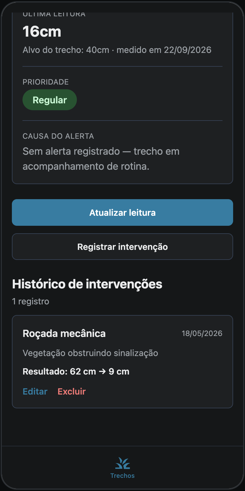
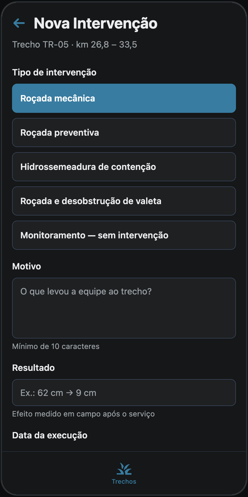
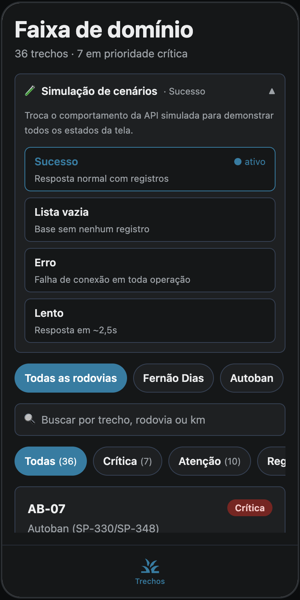
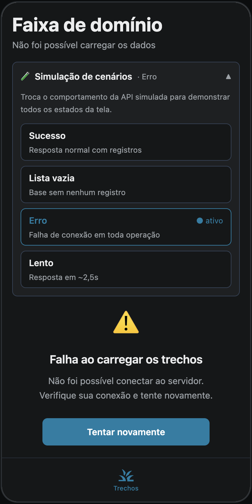

# Capturas de Tela — Sprint 4

Telas do aplicativo com o comentário do que cada uma demonstra.

> **Sobre as imagens.** Foram capturadas da build web do projeto — **mesmo código-fonte
> das telas nativas** — com o viewport restrito à largura de um celular (390 px), para
> que o layout fluísse como no aparelho. Não são capturas do APK instalado: essas serão
> feitas durante a execução do [documento de testes](TESTES-MANUAIS.md).

---

## 1. Fila de roçada por prioridade

A tela inicial **não é uma lista de registros — é uma fila de trabalho**. Os 36 trechos
chegam ordenados por prioridade, então o que está crítico aparece no topo sem ninguém
precisar procurar.

O cabeçalho resume a operação: *36 trechos · 7 em prioridade crítica*. Os chips de filtro
trazem a contagem por faixa (7 críticas, 10 em atenção, 19 regulares), e a soma fecha com
o total — é uma conferência visual de que a classificação não perdeu nenhum trecho.

Cada card responde quatro perguntas de uma vez: **onde** (rodovia e quilometragem),
**o quê** (a causa do alerta), **que tipo de área** e **quanto** — a medição contra o
alvo, lado a lado. Em `AB-07`, "60cm · alvo 40cm" já diz que está 50% acima do limite.

---

## 2. Alvo contextual — o diferencial do produto

Esta é a tela mais importante do conjunto.

O trecho `TR-03` tem **68 cm de vegetação e alvo de 25 cm** — não os 40 cm padrão. O alvo
foi endurecido porque a causa do alerta é **visibilidade**: é um trecho com placa de
sinalização ou curva de raio reduzido, onde a vegetação obstrui a leitura da via bem
antes de chegar aos 40 cm.

É o que separa a solução de um sistema genérico de inspeção. Com limiar único para toda a
rodovia, trechos de visibilidade seriam reportados como estáveis enquanto já comprometem
a segurança. A regra está em [`src/utils/vegetacao.ts`](../src/utils/vegetacao.ts) e é
coberta por testes automatizados.

Note também a ação recomendada logo abaixo da causa: a equipe não recebe só um alerta,
recebe o que fazer.

---

## 3. Talude — o critério se inverte

No talude o problema é o oposto do acostamento: **não é vegetação demais, é de menos**.

O trecho `PR-03`, na descida da Serra do Mar, tem **26% de cobertura vegetal contra alvo
de 50%**. Solo exposto erode e, em época de chuva, desliza sobre a pista. A unidade muda
de centímetros para porcentagem, e a comparação inverte de sentido.

Ter as duas lógicas no mesmo produto é o que permite cobrir a faixa de domínio inteira.
A maioria das ferramentas de inspeção trata só o primeiro caso.

---

## 4. Histórico de intervenções

Cada trecho guarda o que já foi feito nele: tipo de serviço, data, motivo e **o resultado
medido** — "62 cm → 9 cm". Não é um log de ordens de serviço, é a trajetória daquele ponto
da rodovia ao longo do tempo.

Isso responde a duas necessidades diferentes. Para a operação, mostra quantas vezes um
trecho voltou a criticar e o que funcionou ali. Para a diretoria, é evidência documental
do serviço executado, apresentável ao poder concedente.

Os registros têm edição e exclusão — a exclusão passa por diálogo de confirmação.

---

## 5. Registro de intervenção

O formulário fala a língua da conservação rodoviária: roçada mecânica, roçada preventiva,
hidrossemeadura de contenção, desobstrução de valeta e monitoramento sem intervenção —
que é uma decisão legítima e fica documentada como tal.

O campo *Resultado* traz o exemplo "62 cm → 9 cm" como placeholder, orientando o
preenchimento sem precisar de treinamento. Todos os campos validam antes de salvar, e o
cabeçalho mantém o contexto do trecho visível o tempo todo.

---

## 6. Simulação de cenários

Painel que troca o comportamento da API simulada em tempo de execução. Existe porque
alguns estados de tela **nunca apareceriam com dados estáticos**: não dá para demonstrar
tratamento de erro de rede se a base sempre responde.

São quatro cenários — resposta normal, base vazia, falha de conexão em toda operação e
resposta lenta (~2,5 s). O cenário de lista vazia esvazia a base apenas em memória: o que
está gravado no aparelho não é apagado e volta ao trocar de cenário.

---

## 7. Estado de erro

Com o cenário de erro ativo, a tela não trava nem fica em branco: informa o que houve, com
a mensagem vinda da camada de serviço, e oferece **"Tentar novamente"**.

O mesmo tratamento vale para as operações de escrita — se a gravação falha, o aviso
aparece no topo do formulário e **os dados digitados são preservados**, para a equipe não
ter que redigitar tudo.

---

## Resumo

| Captura | Demonstra |
|---|---|
| 1 | Fila ordenada por prioridade, filtros com contagem |
| 2 | **Alvo contextual de 25 cm** — o diferencial do produto |
| 3 | Critério invertido no talude (cobertura em vez de altura) |
| 4 | Histórico de intervenções com resultado medido |
| 5 | Registro no vocabulário da conservação rodoviária |
| 6 | Quatro cenários simulados |
| 7 | Tratamento de erro com nova tentativa |
